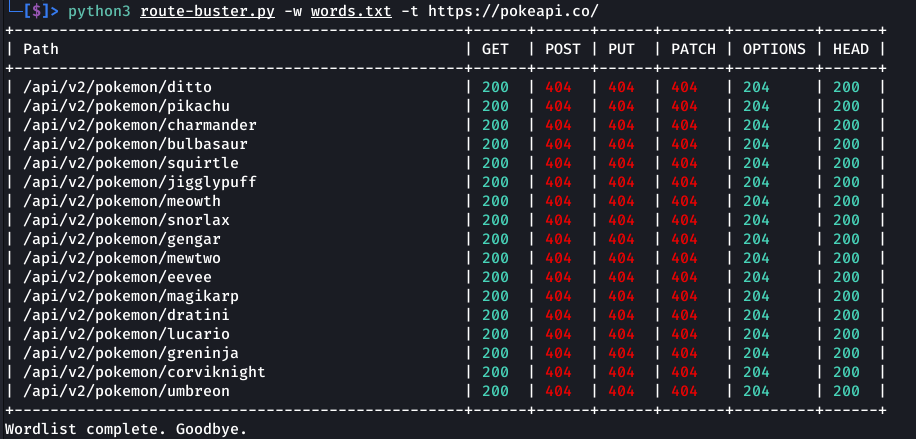

# Library of Useful Scripts:

`website-testing.sh` runs the following tools:
- CMSeek  
- Dorks Hunter  
- Shodan subdomains  
- whois
- dig domain checks
- curl header checks
- feroxbuster  
- dirsearch  
- nikto  
- rustscan  
- katana  
- nuclei  
- testssl.sh  
- shcheck.py  
- wafw00f  
- postleaks  
- whatweb  
- firefox (for clickjacking test)

`route-buster.py` is a python script that checks HTTP Methods against a list of API endpoints
- Create a word list of api endpoints in this format `/api/v1/endpointname`
- This script is great for finding BOLA (Broken Object Level Authentication) vulnerabilities
- 

